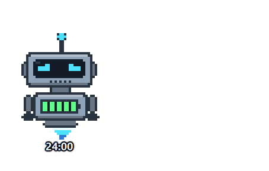
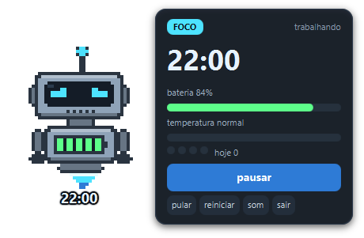
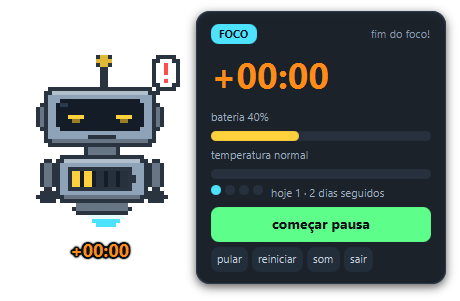
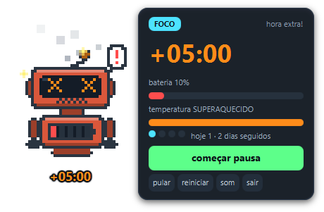
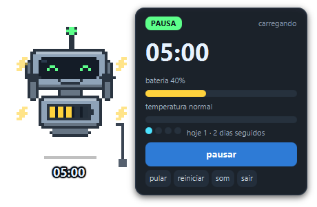
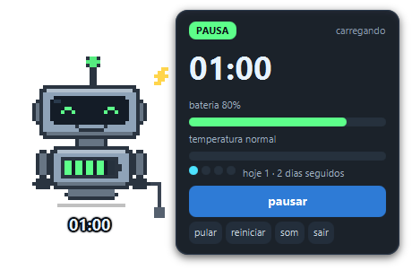
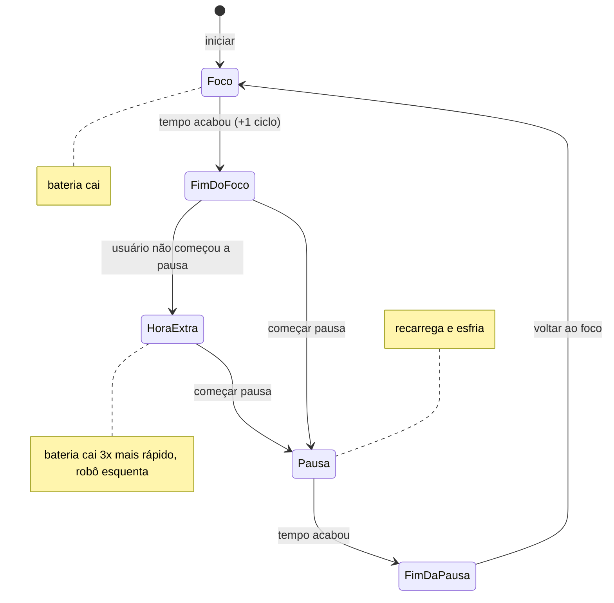

<div align="center">



# Robodoro

**Um Pomodoro de mesa com um robozinho que descarrega enquanto você trabalha — e superaquece se você pular a pausa.**


</div>

---

O Robodoro fica flutuando num canto da tela, com fundo transparente e sempre por cima das outras janelas. O robô tem uma bateria no peito:

- **no foco**, ela vai descarregando e o robô vai ficando cansado;
- **na pausa**, ele vai para a tomada e recarrega;
- **se o foco acabar e você continuar trabalhando**, começa a contar *hora extra*: a bateria drena três vezes mais rápido, a lataria esquenta até ficar vermelha, sai fumaça, soltam faíscas e os olhos começam a girar.

A ideia é simples: **pular a pausa tem consequência visível.**

## Como ele fica

| Focado | Fim do foco | Hora extra |
|:---:|:---:|:---:|
|  |  |  |
| Bateria cheia, olhos concentrados, propulsor forte | Bateria baixa, olhos pesados, alerta "!" pedindo a pausa | 5 min ignorando a pausa: vermelho, fumaça, faíscas |

| Começou a pausa | Na tomada |
|:---:|:---:|
|  |  |
| Braços para cima, raios voando e um arpejo de "carregando" | Pousa, liga o cabo e a bateria vai enchendo segmento por segmento |

> Todas as imagens acima foram geradas pelo próprio app (`--capturas=docs`), que simula cada situação na sessão real e fotografa a janela. Não há montagem manual.

## Como rodar

Pré-requisito: Java 21.

```bash
./mvnw javafx:run
```

Modo demonstração, com fases de segundos para ver o ciclo inteiro (inclusive o superaquecimento) em menos de um minuto:

```bash
./mvnw javafx:run -Djavafx.args=--demo
```

**Sem Java instalado:** cada execução do CI gera o artefato `robodoro-windows`, um zip com o Java embutido. Extraia e rode `bin/robodoro.bat`. Para gerar esse pacote na sua máquina:

```bash
./mvnw javafx:jlink     # gera target/robodoro.zip
```

## Controles

| Ação | Como |
|---|---|
| Mostrar o painel | Passar o mouse sobre o robô |
| Iniciar / pausar / começar a próxima fase | Clicar no robô, botão principal, `Espaço` ou `Enter` |
| Pular a fase | Botão *pular* ou `S` |
| Reiniciar a sessão | Botão *reiniciar* ou `R` |
| Ligar/desligar o som | Botão *som* ou `M` |
| Mover a janela | Arrastar o robô |
| Menu com todas as ações | Clique direito no robô |
| Sair | Botão *sair* ou `Esc` |

## Como funciona

### Ciclo



- **A troca de fase é sempre manual.** O app nunca começa a pausa por você: começar a pausa é um gesto seu, e é ele que dispara a comemoração.
- **Pausa longa a cada 4 focos.** Os 4 pontinhos do painel mostram a rodada.
- **Pular um foco não conta como ciclo.** Ele não entra no histórico nem aproxima a pausa longa.

### Bateria e temperatura

As taxas são definidas **por fase completa**, não por segundo. Por isso, mudar a duração das fases não desequilibra nada:

| Situação | Bateria | Temperatura |
|---|---|---|
| Foco (25 min) | −50 por foco completo | esfria |
| Pausa curta (5 min) | +50 por pausa completa | esfria em meia pausa |
| Pausa longa (15 min) | +100 (enche) | esfria |
| Hora extra | −3× a taxa do foco | superaquece em 5 min |

Com os valores padrão, um ciclo foco + pausa leva de 90% a 40% e volta a 90%. Na hora extra, cada minuto custa tanta bateria quanto três minutos de foco.

### Estados do robô

| Estado | Quando | Aparência |
|---|---|---|
| Focado | foco com bateria > 40% | olhos concentrados, LED ciano |
| Cansado | bateria ≤ 40% | olhos semicerrados, LED amarelo, antena caindo |
| Crítico | bateria ≤ 15% | olhos vermelhos piscando, faíscas, propulsor engasgando |
| Superaquecendo | temperatura ≥ 50% | lataria avermelhando, fumaça, olhos em X girando |
| Carregando | durante a pausa | pousado na tomada, raio flutuando, segmentos enchendo |
| Descansado | fora do foco com bateria boa | olhos redondos, sorriso |

O superaquecimento tem prioridade sobre todos os outros estados: se o robô está pegando fogo, é isso que ele mostra.

### Histórico

Cada foco completo fica salvo em `~/.robodoro/historico.txt`, uma linha por dia (`2026-09-30;4`). O painel mostra quantos focos você fez hoje e há quantos dias seguidos está usando.
- A gravação usa um arquivo temporário e depois troca: se o app fechar no meio, o arquivo antigo continua inteiro.
- Linhas corrompidas são ignoradas: perder um dia é melhor que o app não abrir.

## Arquitetura

A regra do jogo não conhece JavaFX. Tudo que decide *o que acontece* e *qual cara o robô faz* é Java puro e testado sem abrir janela:

```
src/main/java/com/thiagofernandes/robodoro
├── core/        regra pura: Sessao (máquina de estados), Configuracao, Historico, ArquivoHistorico
├── visual/      Aparencia: traduz o estado da sessão em olhos, boca, cores, fumaça, cabo...
└── ui/          JavaFX: janela transparente, DesenhistaRobo (pixel art), Bipador (som), Capturas
```

| Camada | Responsabilidade | Testes |
|---|---|---|
| `core` | tempo, fases, bateria, hora extra, temperatura, pausa longa, histórico | `SessaoTest`, `HistoricoTest`, `FormatoTempoTest` |
| `visual` | estado → aparência (sem tipos do JavaFX; cores são inteiros RGB) | `AparenciaTest` |
| `ui` | desenhar e reagir a eventos | verificado pelas capturas geradas |

Detalhes que valem citar:

- **Pixel art sem nenhuma imagem.** O robô é desenhado a cada quadro numa grade lógica de 46×58, ampliada 4 vezes. Olhos, boca, antena, fumaça e raios são padrões de pixels no código.
- **Som sintetizado.** Os bipes são ondas quadradas geradas na hora com `javax.sound`, numa thread separada. Se o computador não tiver saída de som, o robô só fica mudo.
- **Transparência sem código nativo.** A janela usa `StageStyle.TRANSPARENT` do JavaFX, sem chamadas específicas de sistema operacional. No Linux, a transparência depende de o ambiente gráfico ter compositor.
- **Módulo Java de verdade** (`module-info.java`). É o que permite o `jlink` gerar um runtime enxuto, com só os módulos usados.

## Testes

```bash
./mvnw verify
```

São 55 testes. Entre eles, um pegou um bug real durante o desenvolvimento: a próxima fase era calculada depois de o estado "aguardando" ser limpo, e isso mandava o usuário para a pausa longa já no primeiro ciclo.

## Inspiração

Este projeto foi inspirado no [Pomodoro Pet da Elen Sales](https://github.com/elen-c-sales/pomodoro-diabrete), em Python com Pygame. Lá, um monstrinho vira um demoniozinho conforme cansa. A ideia de um bichinho que reage ao seu cansaço veio de lá. O código, o personagem e a mecânica de hora extra e superaquecimento são próprios.

## Licença

[MIT](LICENSE)
